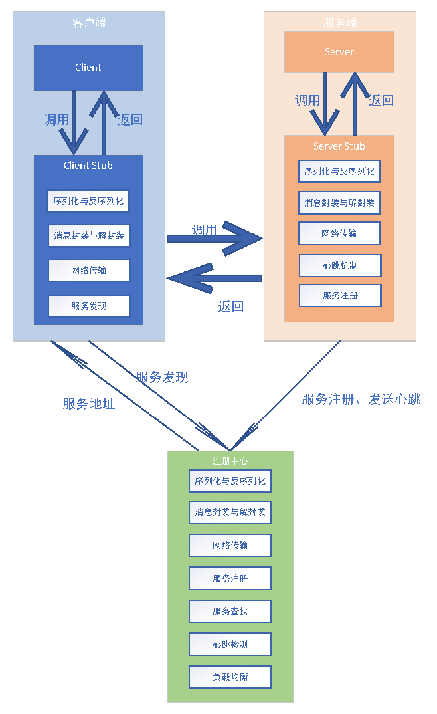

# A-Simple-RPC
简单的rpc框架实现

RPC 是一种进程间通信的方法，它允许程序以调用本地函数的形式来调用远程函数：RPC框架会隐藏底层通信的细节，虽然RPC是一个请求响应模型，但
是客户端并不会感知到这一点。

本项目采用python语言来实现RPC框架，完全依托于python语言自带的标准库，从底层框架开始搭建 RPC 框架

本项目的整体框架图如下：

目前负载均衡还有待进一步完善，在未来，预计可能会引入异步I/O与线程池